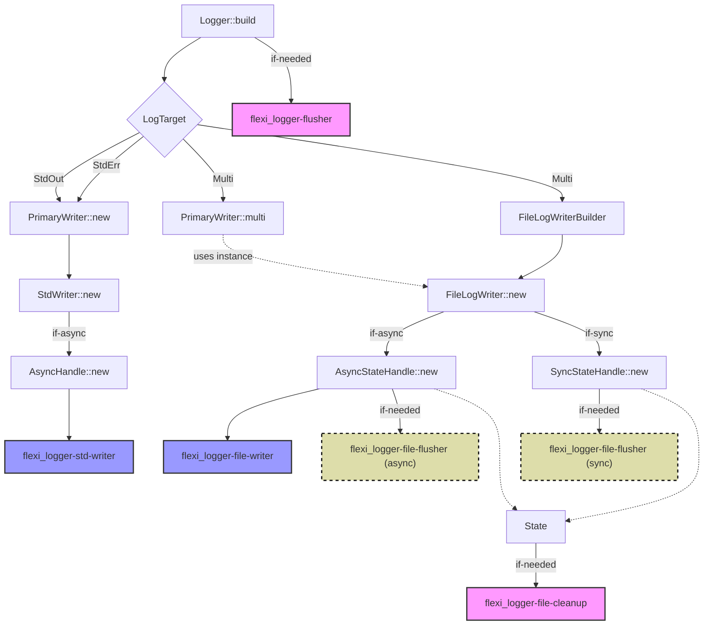

# Threads in `flexi_logger`

## Initialization Flow

## src/threads.rs

### `flexi_logger-flusher`

Flushes primary writer and other writers with cadence `flush_interval`.

Is started in method `start_flusher_thread`, which is called in `Logger::build` if

* Logger.flush_interval is not empty
* *neither* of `WriteMode::Direct`, `SupportCapture`,
  `BufferDontFlush` or `BufferDontFlushWith(_)` is chosen

Has stack_size(1024).

### `flexi_logger-std-writer`

Is only available with feature "async".

Flushes the file or really writes to stdout or stderr.

Can be pinned to a configurable core.

Is started in method `start_async_stdwriter`, which is called in constructor of StdWriter
if `WriteMode::Async` or `WriteMode::AsyncWith` is chosen.

Has rust default stack_size = 2 \* 1024 \* 1024.

## src/writers/file_log_writer/state.rs

### FileLogWriter: `flexi_logger-file-writer`

Is only available with feature "async".

Flushes, or writes to the FileLogWriter's buffer.

Can be pinned to a configurable core.

Is started in method `start_async_fs_writer`, which is called during the initialization
of FileLogWriter, if WriteMode::Async or WriteMode::AsyncWith is chosen.

Has rust's default stack_size = 2 \* 1024 \* 1024.

### FileLogWriter: `flexi_logger-file-flusher (sync)`

Is *only* used if FileLogWriter is used in a custom LogWriter implementation.

Flushes the FileLogWriter's file.

Is started in method `start_sync_flusher`, which is called during the intialization of
FileLogWriter, if `WriteMode::Direct`, `WriteMode::SupportCapture`, `WriteMode::BufferDontFlush`
or `WriteMode::BufferDontFlushWith(_)` is chosen and if `flush_interval` > 0.

Note that flexi_logger sets `flush_interval = 0` for its "embedded" FileLogWriter!

Has stack_size 1024.

### `flexi_logger-file-flusher (async)`

Is only available with feature "async".

Triggers the flush on the "flexi_logger-file-writer".

Can be pinned to a configurable core.

Is started in method `start_async_fs_flusher`, which is called in the initialization of
FileLogWriter, if `WriteMode::AsyncWith` is chosen and if `flush_interval` > 0.

Has stack_size 1024.

## src/writers/file_log_writer/state/list_and_cleanup.rs

### `flexi_logger-file-cleanup`

Is only spawned when explicitly requested.

Calls `remove_or_compress_too_old_logfiles_impl` which does file system operations.

Is started in method `start_cleanup_thread`, which is called in the initialization
of the FileLogWriter.

Has stack_size 512 * 1024.
